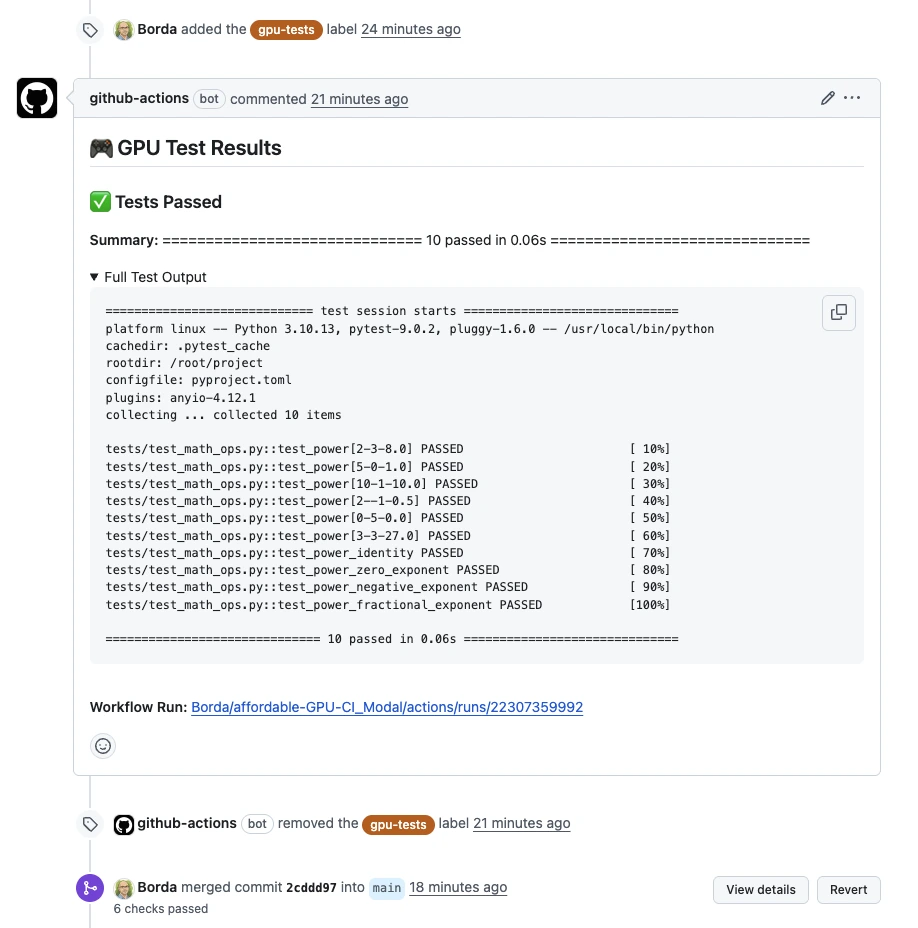
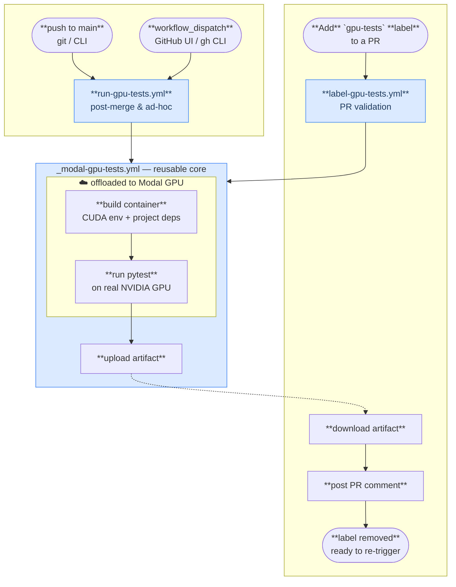

# Affordable GPU CI with Modal

[](.github/workflows/ci_testing.yml)
[](.github/workflows/run-gpu-tests.yml)
[](pyproject.toml)

> When you copy this template to a different repository, update the badge image URLs in the README header to your new `owner/repo`.

> **Stop paying for idle GPU runners.** Run your GPU tests on real NVIDIA hardware for pennies — or free — using [Modal](https://modal.com)'s serverless GPUs.

GPU CI doesn't have to be expensive. With Modal's serverless infrastructure, you spin up a GPU only when tests actually run, pay only for the seconds used, and get results posted directly to your PR. For most open-source projects the **free tier covers everything**.

## 👀 How It Looks

Add a `gpu-tests` label to any PR and get results like this — automatically:



## ⚙️ How It Works



**PR validation (main use case):** A maintainer adds the `gpu-tests` label to a PR — GitHub Actions checks out the PR's actual code, spins up a Modal GPU, runs pytest, posts results as a PR comment, and removes the label. 

**Post-merge validation:** Every push to `main` (or a manual `workflow_dispatch`) also runs the full GPU suite — so you can always trace regressions back to a specific merge.

No GPU runner sitting idle. No per-minute billing for setup time. Pay only for actual test execution.

## 🚀 Setup in 3 Steps

### 1. Copy the workflow files

Files marked with `📋` are the ones to copy into your project. The rest are sample placeholders you can replace or delete.

```
.                                        (📋 = copy to your project)
├── .github/workflows/
│   ├── 📋 _modal-gpu-tests.yml          # Reusable workflow — runs tests on Modal
│   ├── 📋 label-gpu-tests.yml           # Triggered by 'gpu-tests' PR label
│   ├── 📋 run-gpu-tests.yml             # Triggered on push to main / manual dispatch
│   └──    ci_testing.yml               # Standard CPU CI — adapt or replace with yours
├── 📋 .modal/
│   └── test_runner.py                  # Modal app — builds container and runs pytest
├── src/sample_pkg/                      # Sample package — replace with your code
└── tests/                              # Sample tests — replace with your tests
```

### 2. Add your Modal credentials as repository secrets

Go to **Settings → Secrets → Actions** and add:

| Secret | Value |
|---|---|
| `MODAL_TOKEN_ID` | Your Modal token ID |
| `MODAL_TOKEN_SECRET` | Your Modal token secret |

Get your token at [modal.com](https://modal.com) — free signup, no credit card needed for the free tier.

### 3. Trigger a run

Add the `gpu-tests` label to any open PR. That's it.

```bash
# Prerequisites for local runs:
# 1) uv tool install modal   (or: pip install modal)
# 2) modal token new
#
# Or run locally:
modal run .modal/test_runner.py

# With a specific GPU:
MODAL_GPU=A100 modal run .modal/test_runner.py

# With custom pytest args:
modal run .modal/test_runner.py --test-path tests/ --pytest-args "-v -k gpu"
```

## 🆓 Free Tier Is Enough for Most Projects

Modal's free tier gives you **$30 of compute per month**.

A typical test run on an L4 GPU (24 GB VRAM) takes 2–5 minutes and costs around **$0.01–0.02**. That's well over **1,000 GPU test runs per month** on the free tier — enough for any active open-source project.

| GPU | VRAM | Typical cost per run |
|---|---|---|
| T4 | 16 GB | ~$0.005 |
| L4 | 24 GB | ~$0.01 |
| A10G | 24 GB | ~$0.02 |
| A100 | 40/80 GB | ~$0.05 |

> **Note:** Prices are approximate as of February 2026. For current pricing, see the [Modal pricing page](https://modal.com/pricing).

Set the GPU type with a repository variable `MODAL_GPU` (defaults to `L4`).

## 🔀 Workflow Overview

| Workflow | Trigger | Purpose | Who can trigger |
|---|---|---|---|
| `label-gpu-tests.yml` | `pull_request` + `gpu-tests` label | PR validation — test PR code, post results as a comment | Maintainers only (only they can add labels) |
| `run-gpu-tests.yml` | `push` to `main` | Post-merge validation — confirm GPU tests pass after merge | Maintainers (merge to main) |
| `run-gpu-tests.yml` | `workflow_dispatch` | Ad-hoc run on any ref | Maintainers (repository write access) |
| `_modal-gpu-tests.yml` | `workflow_call` | Reusable core — called by the above two | — (not triggered directly) |

### Why Labels Are the Right Trigger

GPU tests cost real money (even if small) and expose your Modal credentials to the workflow. You don't want every external contributor's PR to trigger them automatically.

GitHub's label system is a natural access gate: **only repository maintainers and collaborators with write access can add labels**. External contributors cannot. This means:

- A fork PR from an unknown contributor will never trigger GPU tests automatically
- A maintainer reviews the PR, decides it needs GPU validation, and adds the label
- Tests run once, results appear as a comment, the label is removed — ready to trigger again if needed

This is the same pattern used to guard cost-sensitive or credential-sensitive CI steps in many open-source projects.

### Alternative Triggers (Also Maintainer-Controlled)

For cases where GPU tests should run without a label:

- **Push to `main`** — runs automatically after a PR is merged. Only maintainers can merge to `main`.
- **`workflow_dispatch`** — manual trigger from the GitHub Actions UI or CLI. Only users with repository write access can dispatch workflows.

Both alternatives are equally safe and complement the label flow for post-merge validation.

### PR Label Flow

```yaml
# .github/workflows/label-gpu-tests.yml
on:
  pull_request:
    types: [labeled]

jobs:
  run-if-labeled:
    if: github.event.label.name == 'gpu-tests'
    uses: ./.github/workflows/_modal-gpu-tests.yml
    secrets: inherit
```

The two `pull_request` variants behave differently for fork PRs — choose deliberately:

- ✅ `pull_request` — GitHub's built-in protection applies: **secrets are never passed to workflows triggered by fork PRs**. Combined with the label gate this gives two independent layers: only a maintainer can add the label, and fork code can never reach your Modal credentials regardless. For same-repo PRs (the normal contributor flow) secrets are available and everything works as expected.
- ❌ `pull_request_target` — runs in the base repo's context so secrets are always available, including for fork PRs. That means executing untrusted fork code with your credentials, which is a security risk regardless of other gates.

Results are posted as a PR comment with full pytest output. The label is removed after completion so re-adding it re-triggers the run.

### The Modal Runner

The test runner in `.modal/test_runner.py` is a single file. The core of it:

```python
import modal

app = modal.App("ci-gpu-tests")

image = (
    modal.Image.from_registry("nvcr.io/nvidia/pytorch:25.01-py3")
    .pip_install("uv")
    .add_local_dir(".", remote_path="/root/project", copy=True)
    .run_commands("uv pip install -e . --group tests --system")
)

@app.function(image=image, gpu="L4", timeout=3600)
def run_tests(test_path: str = "tests/", pytest_args: str = "-v") -> dict:
    ...
```

Adapt it to your project by changing the base image, dependencies, or GPU type.

## 🔧 Adapting to Your Project

1. Replace `nvcr.io/nvidia/pytorch:25.01-py3` with your base image (or `modal.Image.debian_slim()` for CPU-only tests)
2. Update the `uv pip install` command to match your project's dependency setup
3. Set `MODAL_GPU` to the GPU type your tests need
4. Add your actual test path

The `.github/workflows/_modal-gpu-tests.yml` reusable workflow and `.modal/test_runner.py` are designed to be dropped into any Python project with minimal changes.

## 🤝 Contributing

Contributions are welcome! If you have ideas for improvements, run into issues, or want to share how you've adapted this for your project — open an issue or a PR on [GitHub](https://github.com/Borda/affordable-GPU-CI_Modal).
